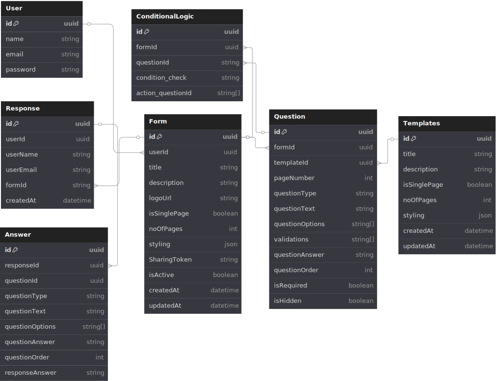

# FormSphere Backend

This is the backend service for FormSphere, built with Node.js, Express, and TypeScript.  
It provides a robust API for managing forms, templates, responses, and user authentication, supporting advanced features like conditional logic, reusable templates, and secure authentication.

---

## 🚀 Tech Stack

- **Runtime:** Node.js
- **Language:** TypeScript
- **Framework:** Express.js
- **Database:** PostgreSQL with Prisma ORM
- **Authentication:** JWT (access & refresh tokens)
- **Validation:** Zod
- **File Uploads:** Cloudinary
- **Code Quality:** ESLint, Prettier, Husky, lint-staged

---

## 📁 Project Structure

```
formsphere_backend/
├── src/
│   ├── configs/             # Configuration files (DB, env, cloudinary)
│   ├── modules/             # Feature modules
│   │   ├── auth/            # Authentication (login, signup, JWT)
│   │   ├── forms/           # Form management (CRUD, conditional logic)
│   │   ├── response/        # Response collection and file uploads
│   │   └── templates/       # Template management
│   └── utils/               # Shared utilities (JWT, response handling)
├── prisma/                  # Prisma schema and migrations
│   └── migrations/
├── .husky/                  # Git hooks
├── .env                     # Environment variables
├── .eslintrc.json           # ESLint configuration
├── .prettierrc              # Prettier configuration
├── package.json             # Project dependencies and scripts
├── tsconfig.json            # TypeScript configuration
└── README.md                # Project documentation
```

---

## 📊 Database Schema

Below is an overview of the main database tables used in FormSphere:  


---

## 🎯 Core Functionality

- **User Management**
  - User registration and authentication (JWT)
  - Secure password hashing with bcrypt
  - Refresh token support for session management

- **Form Management**
  - Create, update, delete, and retrieve forms
  - Drag-and-drop form builder

- **Template Management**
  - Create and manage reusable form templates
  - Streamline form creation with pre-defined templates

- **Response Collection**
  - Submit and retrieve form responses
  - File uploads via Cloudinary

- **API Overview**
  - **Authentication:** Register, login, logout, refresh tokens, and check authentication.
  - **Forms:** Create, update, delete, and retrieve forms.
  - **Templates:** Manage reusable form templates for rapid form creation.
  - **Responses:** Submit and retrieve form responses, including file uploads.

---

## 🛠️ Prerequisites

- Node.js (v14 or higher)
- npm (Node Package Manager)
- TypeScript
- Prisma CLI
- PostgreSQL

---

## 🔧 Installation

1. **Clone the repository**
   ```sh
   git clone https://github.com/Meshwa-Simform/FormSphere-Backend.git
   cd FormSphere-Backend
   ```

2. **Install dependencies**
   ```sh
   npm install
   ```

3. **Set up environment variables**
   ```sh
   cp .env.example .env
   # Edit .env with your configuration
   ```

4. **Initialize the database**
   ```sh
   npx prisma generate
   npx prisma migrate dev
   ```

---

## 🚀 Running the Application

- **Development Mode**
  ```sh
  npm run dev
  ```
- **Production Mode**
  ```sh
  npm run build
  npm start
  ```

---

## 📦 Available Scripts

| Script           | Description                                   |
|------------------|-----------------------------------------------|
| `npm run dev`    | Start development server with hot reload      |
| `npm run build`  | Build the application                         |
| `npm start`      | Start production server                       |
| `npm run lint`   | Run ESLint                                    |
| `npm run format` | Format code with Prettier                     |
| `prepare`        | Set up Husky hooks                            |

---

## 🔐 Environment Variables

- `PORT`: Server port (default: 3000)
- `DATABASE_URL`: PostgreSQL connection string
- `JWT_SECRET`: Secret key for JWT token generation
- `REFRESH_TOKEN_SECRET`: Secret for refresh tokens
- `CLIENT_URL`: Allowed CORS origins
- `CLOUDINARY_CLOUD_NAME`, `CLOUDINARY_API_KEY`, `CLOUDINARY_API_SECRET`: Cloudinary credentials

---

## 📝 Code Quality

- **TypeScript** for type safety
- **ESLint** for code linting
- **Prettier** for code formatting
- **Husky** and **lint-staged** for git hooks and pre-commit checks

---

## 🤝 Contributing

1. Fork the repository
2. Create your feature branch (`git checkout -b feature/feature-name`)
3. Commit your changes (`git commit -m 'Add some feature description'`)
4. Push to the branch (`git push origin feature/feature-name`)
5. Open a Pull Request

---

## Author

**Meshwa Patel**

---